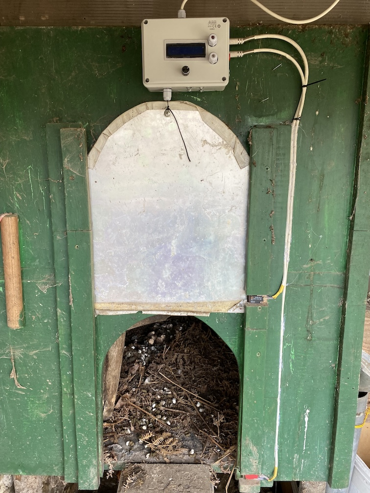
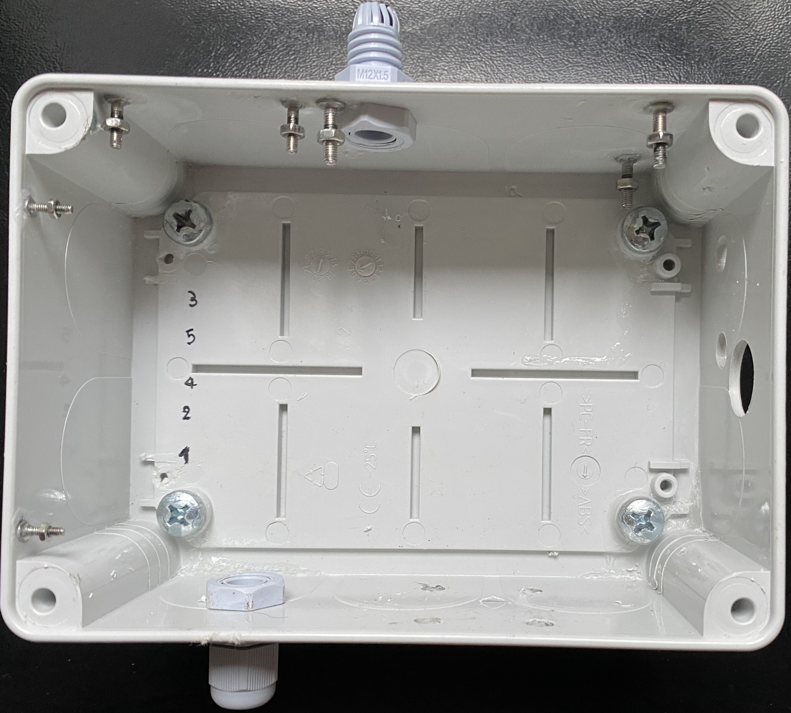
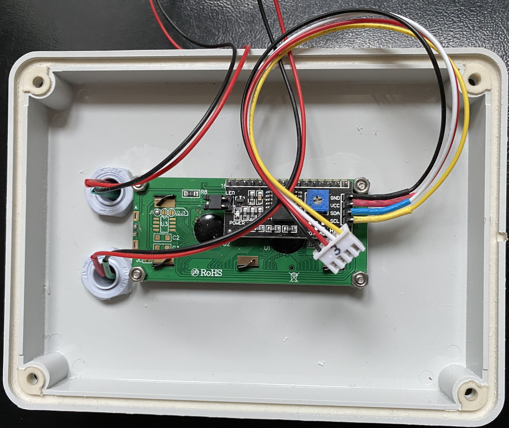
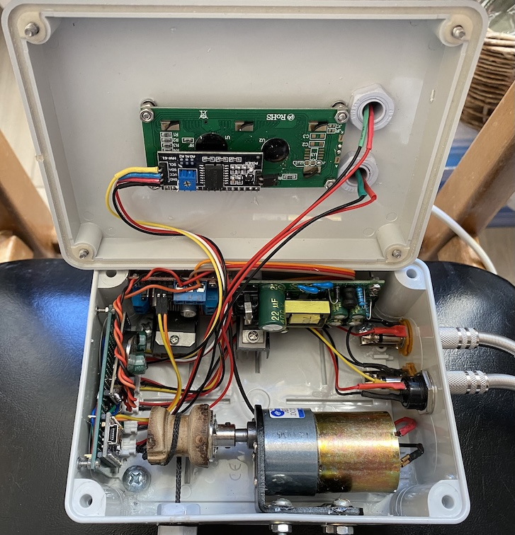

# 🐔 Poulailler Automatique Arduino

> Système automatisé d'ouverture/fermeture de porte de poulailler basé sur Arduino Nano avec gestion de l'heure et de la luminosité.


[🇫🇷 Version française](#) | [🇺🇸 English version](README_EN.md)

---

## 📸 Aperçu du projet

**Version actuelle : 1.4.0** - Version production terrain avec gestion d'erreurs complète

**✅ Testé et validé sur le terrain depuis plusieurs jours !**

### Installation réelle


*Porte automatique installée sur le poulailler*


*Indication du positionnement des vis de fixation dans le boîtier*


*Cablage du LCD et du matériel sur le couvercle*


*Arduino Nano + encodeur rotatif dans boîtier étanche IP54*

## ✨ Fonctionnalités

### 🕐 Gestion automatique intelligente
- **Ouverture automatique** à l'heure configurée (6h-9h paramétrable)
- **Heure minimum fermeture** : Ne jamais fermer avant l'heure configurée (15h-17h) ⭐ **Évite fermeture en hiver juste après ouverture**
- **Fermeture par détection de luminosité** avec temporisation paramétrable (10-30 min anti-nuages)
- **Fermeture de secours** à l'heure max configurée
- **Système anti-obstacle** avec timeout configurable
- **Calibration automatique au démarrage** : Fermeture complète puis ouverture

### 🎛️ Interface utilisateur professionnelle
- **Encodeur rotatif KY-040** : Interface intuitive et réactive
- **Rotation** : Ajuster les valeurs précisément (±1 par cran)
- **Click bref** : Ouvrir/fermer porte (ou rallumer LCD)
- **Click bref en mode réglage** : Naviguer entre les modes ⭐ **Nouveau v1.4.0**
- **Click long (1.5s)** : Entrer en mode réglage ⭐ **Réduit de 3s**
- **Click TRÈS long (5s)** : Acquitter les erreurs ⭐ **Nouveau v1.4.0**
- **Affichage luminosité temps réel** : Alterne avec heure toutes les 3s ⭐ **Nouveau v1.4.0**
- **Gestion intelligente du rétroéclairage LCD** : Extinction automatique après 30s

### 🔒 Sécurités et diagnostics
- **Calibration porte au démarrage** : Vérification complète des capteurs ⭐ **Nouveau v1.4.0**
- **Détection erreurs critiques** avec arrêt automatique :
  - Capteurs fin de course incohérents (2 activés simultanément)
  - Capteur fin de course HS (timeout sans déclenchement)
  - RTC aberrant (année invalide) ou figé
- **Détection alertes** avec fonctionnement dégradé :
  - Capteur luminosité HS (valeurs extrêmes 0 ou 1023)
  - Tension alimentation faible (< 4.5V)
- **LED clignotement différencié** :
  - 200ms = Erreur critique (arrêt automatique)
  - 1s = Alerte (fonctionnement dégradé)
  - 500ms = Coupure RTC
- **Acquittement erreurs** : Appui très long 5s
- **Sauvegarde EEPROM** des paramètres

## 🆕 Nouveautés Version 1.4.0

### 🎯 Interface améliorée (retours terrain)
- ✅ **Appui long 1.5s** (au lieu de 3s) - Plus rapide pour entrer en mode réglage
- ✅ **Navigation par appui bref** entre modes (au lieu d'appui long) - Plus pratique
- ✅ **Affichage luminosité** en temps réel sur LCD - Contrôle visuel facile
- ✅ **Acquittement erreurs 5s** - Reset sécurisé des erreurs critiques

### ⚙️ Nouveaux réglages (10 modes configurables)
1. **Heure ouverture** (6h-9h) ⭐ Paramétrable
2. **Minute ouverture** ⭐ Paramétrable
3. **Heure minimum fermeture** (15h-17h) ⭐ **NOUVEAU** - Ne jamais fermer avant
4. **Minute minimum fermeture** ⭐ **NOUVEAU**
5. **Heure fermeture secours** ⭐ Paramétrable
6. **Minute fermeture secours** ⭐ Paramétrable
7. **Seuil luminosité** (par défaut 100 au lieu de 300)
8. **Temporisation fermeture** (10-30 min) ⭐ **NOUVEAU** - Paramétrable
9. **Timeout ouverture** (5-60s)
10. **Timeout fermeture** (5-60s)

### 🛡️ Gestion d'erreurs complète
- ✅ **Calibration au démarrage** : Test complet fermeture/ouverture
- ✅ **Détection capteurs incohérents** : Les 2 capteurs activés = impossible
- ✅ **Détection RTC figé** : Vérification heure qui progresse
- ✅ **Détection capteur luminosité HS** : Valeurs 0 ou 1023 constantes
- ✅ **Détection tension faible** : Batterie/alimentation < 4.5V
- ✅ **Arrêt automatique** : Blocage du mode automatique si erreur critique
- ✅ **Messages LCD explicites** : Indication claire du type d'erreur

## 🔧 Matériel requis

**Composants principaux** (voir [`docs/liste_composants.md`](docs/liste_composants.md)) :
- Arduino Nano (ATmega328P)
- Module RTC DS3231 (I2C)
- Écran LCD 16x2 I2C
- Module contrôleur moteur L298N
- **Encodeur rotatif KY-040** (~2-3€)
- Capteur de luminosité (LDR)
- 2x Capteurs fin de course
- Moteur CC 12V
- LED rouge
- Alimentation 12V 2A

**Matériel optionnel recommandé :**
- 2x Condensateurs céramiques 100nF (filtrage encodeur CLK-GND, DT-GND)

**Budget estimé** : 145-205€

## 📚 Bibliothèques Arduino requises

Installation via le gestionnaire de bibliothèques Arduino IDE :

1. **RTClib** (Adafruit) - Version >= 2.0.0
2. **LiquidCrystal_I2C** (Frank de Brabander) - Version >= 1.1.2
3. **Encoder** (Paul Stoffregen) - Version >= 1.4.0

## 📐 Schéma de câblage

```
Arduino Nano    →    Composant
─────────────────────────────────
A0              →    Capteur luminosité
D2              →    Encodeur CLK (interruption)
D3              →    LED coupure courant
D4              →    Encodeur DT (interruption)
D5              →    Encodeur SW (bouton)
D6              →    L298N IN2
D7              →    L298N IN1
D8              →    Fin course HAUT
D9              →    Fin course BAS
SDA (A4)        →    LCD + RTC (I2C)
SCL (A5)        →    LCD + RTC (I2C)
5V              →    Alimentation modules
GND             →    Masse commune
```

**Schémas détaillés** : Voir [`docs/guide_cablage.md`](docs/guide_cablage.md)

## 🚀 Installation rapide

### 1. Téléchargement
```bash
git clone https://github.com/fbaillon19/poulailler-automatique.git
cd poulailler-automatique
```

### 2. Installation des bibliothèques
Ouvrir Arduino IDE → Croquis → Inclure une bibliothèque → Gérer les bibliothèques
- Rechercher et installer : `RTClib`, `LiquidCrystal_I2C`, `Encoder`

### 3. Ouverture du projet
1. Ouvrir le dossier `code/poulailler_automatique/`
2. Double-cliquer sur `poulailler_automatique_v1.4.0.ino`
3. Vérifier que `rotary_encoder.h` et `rotary_encoder.cpp` sont présents

### 4. Compilation et téléversement
1. Sélectionner : **Outils → Type de carte → Arduino Nano**
2. Sélectionner : **Outils → Processeur → ATmega328P (Old Bootloader)**
3. Compiler et téléverser

## 📱 Utilisation

### Mode Normal
| Action | Résultat |
|--------|----------|
| **Tourner encodeur** | Aucun effet |
| **Click bref** | Ouvrir/fermer porte (ou rallumer LCD si éteint) |
| **Click long (1.5s)** | Entrer en mode réglage |
| **Click TRÈS long (5s)** | Acquitter erreur critique |

### Modes de Réglage (10 modes)

**Navigation :**
- **Click long 1.5s** → Entrer en mode réglage
- **Click bref** → Passer au mode suivant
- **Tourner CW (horaire)** → Incrémenter valeur (+1)
- **Tourner CCW (anti-horaire)** → Décrémenter valeur (-1)

**Séquence :**
1. MODE_REGLAGE_HEURE_OUVERTURE → Heure ouverture (6h-9h)
2. MODE_REGLAGE_MINUTE_OUVERTURE → Minute ouverture
3. MODE_REGLAGE_HEURE_MIN_FERMETURE → Heure min fermeture (15h-17h) ⭐ **Nouveau**
4. MODE_REGLAGE_MINUTE_MIN_FERMETURE → Minute min fermeture ⭐ **Nouveau**
5. MODE_REGLAGE_HEURE_MAX_FERMETURE → Heure fermeture secours
6. MODE_REGLAGE_MINUTE_MAX_FERMETURE → Minute fermeture secours
7. MODE_REGLAGE_SEUIL → Seuil luminosité (0-1023)
8. MODE_REGLAGE_TEMPO_FERMETURE → Temporisation (10-30 min) ⭐ **Nouveau**
9. MODE_REGLAGE_TIMEOUT_OUVERTURE → Timeout moteur ouverture
10. MODE_REGLAGE_TIMEOUT_FERMETURE → Timeout moteur fermeture
11. Retour MODE_NORMAL (sauvegarde automatique + extinction LCD)

**Timeout :** 30 secondes sans action → retour automatique MODE_NORMAL

## 📂 Structure du projet

```
poulailler-automatique/
├── code/
│   └── poulailler_automatique/
│       ├── poulailler_automatique_v1.4.0.ino  # Fichier principal
│       ├── rotary_encoder.h                    # Header encodeur
│       └── rotary_encoder.cpp                  # Implémentation encodeur
├── docs/
│   ├── liste_composants.md
│   ├── guide_cablage.md
│   ├── guide_montage.md
│   └── README_v1.4.0.md
├── schemas/
│   └── schema_description.md
├── README.md
├── CHANGELOG.md
├── LICENSE
└── .gitignore
```

## 🔍 Diagnostic et messages

### Messages moniteur série (9600 bauds)
```
=== CALIBRATION PORTE AU DÉMARRAGE ===
État initial: HAUT=OFF BAS=ON
Descente vers position BAS...
Position BAS atteinte
Montée vers position HAUT...
Position HAUT atteinte
=== CALIBRATION RÉUSSIE ===

Encodeur KY-040 initialisé
  Appui long: 1.5s, Appui très long: 5s
=== SYSTÈME INITIALISÉ ===
Paramètres:
  Heure ouverture: 7:0
  Heure min fermeture: 16:0
  Seuil luminosité: 100
  Temporisation: 10 min
```

### Messages LCD
- **Mode normal** : `07:15` ou `Lum:45` (alterne toutes les 3s)
- **Mouvement** : `Ouverture...` / `Fermeture...`
- **Temporisation** : `Ferme dans 8mn`
- **Erreur critique** : `ERR: CAPTEURS` / `2 actifs! 5s=OK`
- **Alerte** : `ALERTE LUMIERE` / `Val extreme`

### LED d'alerte
- **Clignotement rapide (200ms)** : Erreur critique → Arrêt automatique
- **Clignotement lent (1s)** : Alerte → Fonctionnement dégradé
- **Clignotement moyen (500ms)** : Pile RTC à remplacer

## 🤝 Contribution

Les contributions sont les bienvenues ! 

1. **Fork** le projet
2. Créer une **branche feature** (`git checkout -b feature/amelioration`)
3. **Commit** vos changements (`git commit -m 'Ajout fonctionnalité'`)
4. **Push** vers la branche (`git push origin feature/amelioration`)
5. Ouvrir une **Pull Request**

## 📝 Changelog

### Version 1.4.0 (Janvier 2026) ⭐ **PRODUCTION**
- ✅ Interface améliorée suite retours terrain
- ✅ Heure minimum fermeture paramétrable (évite fermeture immédiate hiver)
- ✅ Temporisation fermeture paramétrable (10-30 min)
- ✅ Seuil par défaut abaissé à 100 (terrain validé à 30)
- ✅ Affichage luminosité temps réel sur LCD
- ✅ Calibration automatique au démarrage
- ✅ Gestion d'erreurs complète avec LED différenciée
- ✅ Appui long 1.5s (au lieu de 3s)
- ✅ Navigation par appui bref entre modes
- ✅ Acquittement erreurs par appui 5s
- ✅ 10 modes de réglage au total

### Version 1.3.0 (Décembre 2025)
- ✅ Encodeur rotatif KY-040
- ✅ Bibliothèque Encoder de Paul Stoffregen

### Version 1.2.0 (Décembre 2025)
- ✅ Refactorisation avec OneButton

### Version 1.1.0 (Décembre 2025)
- ✅ Gestion intelligente rétroéclairage LCD

### Version 1.0.0 (Décembre 2025)
- ✅ Version initiale fonctionnelle

## 📄 Licence

Ce projet est sous licence **MIT** - voir le fichier [LICENSE](LICENSE) pour plus de détails.

## 🙏 Remerciements

- Communauté Arduino pour les bibliothèques
- Paul Stoffregen pour la bibliothèque Encoder
- Forums makers pour les conseils mécaniques
- Testeurs terrain pour les retours d'expérience

## 📞 Support

- **Issues GitHub** : Pour les bugs et suggestions
- **Discussions** : Questions générales

---

⭐ **N'hésitez pas à mettre une étoile si ce projet vous a aidé !** ⭐

**Auteur** : Frédéric BAILLON  
**Version** : 1.4.0 - Production  
**Date** : Janvier 2026  
**Statut** : ✅ Testé et validé sur le terrain

## ✨ Fonctionnalités

### 🕐 Gestion automatique
- **Ouverture automatique à 7h00** du matin
- **Fermeture par détection de luminosité** (avec temporisation 10 min anti-nuages)
- **Fermeture forcée à 23h00** (sécurité)
- **Système anti-obstacle** avec timeout configurable

### 🎛️ Interface utilisateur (Version 1.3.0)
- **Encodeur rotatif KY-040** : Interface professionnelle et intuitive
- **Rotation** : Ajuster les valeurs (heure, seuil, timeouts) précisément
- **Click bref** : Ouvrir/fermer porte manuellement (ou rallumer LCD)
- **Click long (3s)** : Navigation dans les modes de réglage
- **Gestion intelligente du rétroéclairage LCD** : Extinction automatique après 30s

### 🔒 Sécurités
- **Capteurs de fin de course** haut et bas
- **Détection d'obstacles** avec timeout moteur
- **Sauvegarde EEPROM** des paramètres
- **LED d'alerte** coupure de courant

## 🆕 Nouveautés Version 1.3.0

### 🎯 Interface encodeur rotatif KY-040
- ✅ **Rotation intuitive** : Tourner pour modifier les valeurs (±1 par cran)
- ✅ **100% fiable** : Bibliothèque Encoder de Paul Stoffregen (référence Arduino)
- ✅ **Détection matérielle** : Interruptions pour réactivité parfaite
- ✅ **Plus de bugs timing** : Fini les problèmes de click/double-click
- ✅ **Code simplifié** : Architecture procédurale propre

### 🐛 Corrections importantes
- ✅ **Bug double-clic** : Supprimé, remplacé par rotation
- ✅ **Blocages LCD** : Rafraîchissement throttlé (200ms)
- ✅ **Timeouts réglage** : 30s avec extinction automatique LCD

## 🔧 Matériel requis

**Composants principaux** (voir [`docs/liste_composants.md`](docs/liste_composants.md) pour la liste complète) :
- Arduino Nano (ATmega328P)
- Module RTC DS3231 (I2C)
- Écran LCD 16x2 I2C
- Module contrôleur moteur L298N
- **Encodeur rotatif KY-040** ⭐ NOUVEAU (~2-3€)
- Capteur de luminosité (LDR)
- 2x Capteurs fin de course
- Moteur CC 12V
- LED rouge
- Alimentation 12V 2A

**Matériel optionnel recommandé :**
- 2x Condensateurs céramiques 100nF (filtrage encodeur)

**Budget estimé** : 145-205€ selon choix moteur et mécanique

## 📚 Bibliothèques Arduino requises

Installation via le gestionnaire de bibliothèques Arduino IDE :

1. **RTClib** (Adafruit) - Version >= 2.0.0
2. **LiquidCrystal_I2C** (Frank de Brabander) - Version >= 1.1.2
3. **Encoder** ⭐ (Paul Stoffregen) - Version >= 1.4.0 - NOUVEAU

## 📐 Schéma de câblage

```
Arduino Nano    →    Composant
─────────────────────────────────
A0              →    Capteur luminosité
D2              →    Encodeur CLK (interruption)
D3              →    LED coupure courant
D4              →    Encodeur DT (interruption)
D5              →    Encodeur SW (bouton)
D6              →    L298N IN2
D7              →    L298N IN1
D8              →    Fin course HAUT
D9              →    Fin course BAS
SDA (A4)        →    LCD + RTC (I2C)
SCL (A5)        →    LCD + RTC (I2C)
5V              →    Alimentation modules
GND             →    Masse commune
```

**Schémas détaillés** : Voir [`docs/guide_cablage.md`](docs/guide_cablage.md)

## 🚀 Installation rapide

### 1. Téléchargement
```bash
git clone https://github.com/fbaillon19/poulailler-automatique.git
cd poulailler-automatique
```

### 2. Installation des bibliothèques
Ouvrir Arduino IDE → Croquis → Inclure une bibliothèque → Gérer les bibliothèques
- Rechercher et installer : `RTClib`, `LiquidCrystal_I2C`, `Encoder`

### 3. Ouverture du projet
1. Ouvrir le dossier `code/poulailler_automatique/`
2. Double-cliquer sur `poulailler_automatique_v1.3.0.ino`
3. Vérifier que les fichiers `rotary_encoder.h` et `rotary_encoder.cpp` sont bien présents

### 4. Compilation et téléversement
1. Sélectionner : **Outils → Type de carte → Arduino Nano**
2. Sélectionner : **Outils → Processeur → ATmega328P (Old Bootloader)**
3. Compiler et téléverser

## 📱 Utilisation

### Mode Normal
| Action | Résultat |
|--------|----------|
| **Tourner encodeur** | Aucun effet |
| **Click bref** | Ouvrir/fermer porte (ou rallumer LCD si éteint) |
| **Click long (3s)** | Entrer en mode réglage HEURE |

### Modes de Réglage

**Navigation :**
- **Click long** → Passer au mode suivant
- **Tourner CW (horaire)** → Incrémenter valeur (+1)
- **Tourner CCW (anti-horaire)** → Décrémenter valeur (-1)

**Séquence :**
1. MODE_REGLAGE_HEURE → Tourner pour ajuster l'heure
2. MODE_REGLAGE_MINUTE → Tourner pour ajuster les minutes
3. MODE_REGLAGE_SEUIL → Tourner pour ajuster le seuil luminosité
4. MODE_REGLAGE_TIMEOUT_OUVERTURE → Tourner pour timeout ouverture
5. MODE_REGLAGE_TIMEOUT_FERMETURE → Tourner pour timeout fermeture
6. Retour MODE_NORMAL + extinction LCD

**Timeout :** 30 secondes sans action → retour automatique MODE_NORMAL + extinction LCD

## 📂 Structure du projet

```
poulailler-automatique/
├── code/
│   └── poulailler_automatique/
│       ├── poulailler_automatique_v1.3.0.ino  # Fichier principal
│       ├── rotary_encoder.h                    # Header encodeur
│       └── rotary_encoder.cpp                  # Implémentation encodeur
├── docs/
│   ├── liste_composants.md        # Liste détaillée des composants
│   ├── guide_cablage.md          # Schémas de câblage
│   ├── guide_montage.md          # Guide assemblage mécanique
│   └── README_v1.3.0.md          # Documentation version 1.3.0
├── schemas/
│   └── schema_description.md     # Description schéma Fritzing
├── README.md                     # Ce fichier
├── README_EN.md                  # Version anglaise
├── CHANGELOG.md                  # Historique des versions
├── LICENSE                       # Licence MIT
└── .gitignore                    # Fichiers à ignorer
```

## 🔍 Diagnostic et débogage

### Messages moniteur série (9600 bauds)
```
Encodeur KY-040 initialisé (bibliothèque Encoder)
  CLK=2 DT=4 SW=5
Système initialisé
Rotation: CW (+1)
  Seuil: 305
Bouton: APPUI LONG
  → MODE_REGLAGE_HEURE
```

### Messages d'état LCD
- `"Porte ouverte"` / `"Porte fermee"` : État normal
- `"Ouverture..."` / `"Fermeture..."` : Mouvement en cours
- `"Ferme dans Xmn"` : Temporisation luminosité active
- `"ERREUR OBSTACLE"` : Obstacle détecté
- `"Tourner encodeur"` : En mode réglage timeout

## 🤝 Contribution

Les contributions sont les bienvenues ! 

1. **Fork** le projet
2. Créer une **branche feature** (`git checkout -b feature/amelioration`)
3. **Commit** vos changements (`git commit -m 'Ajout fonctionnalité'`)
4. **Push** vers la branche (`git push origin feature/amelioration`)
5. Ouvrir une **Pull Request**

## 📝 Changelog

### Version 1.3.0 (Décembre 2025)
- ✅ Encodeur rotatif KY-040 pour interface professionnelle
- ✅ Bibliothèque Encoder de Paul Stoffregen (ultra-fiable)
- ✅ Rotation pour modifier valeurs (±1 par cran)
- ✅ Suppression bugs click/double-click
- ✅ Correction blocages LCD (rafraîchissement throttlé)
- ✅ Timeout réglage 30s avec extinction LCD
- ✅ Architecture procédurale propre

### Version 1.2.0 (Décembre 2025)
- ✅ Refactorisation avec OneButton
- ✅ Architecture modulaire (fichiers .h et .cpp séparés)
- ✅ Correction bug affichage modes timeout

### Version 1.1.0 (Décembre 2025)
- ✅ Gestion intelligente rétroéclairage LCD
- ✅ Extinction automatique après 30s
- ✅ Réveil automatique pendant temporisation

### Version 1.0.0 (Décembre 2025)
- ✅ Version initiale fonctionnelle

## 📄 Licence

Ce projet est sous licence **MIT** - voir le fichier [LICENSE](LICENSE) pour plus de détails.

## 🙏 Remerciements

- Communauté Arduino pour les bibliothèques
- Paul Stoffregen pour la bibliothèque Encoder
- Forums makers pour les conseils mécaniques

## 📞 Support

- **Issues GitHub** : Pour les bugs et suggestions
- **Discussions** : Questions générales
- **Wiki** : Documentation détaillée

---

⭐ **N'hésitez pas à mettre une étoile si ce projet vous a aidé !** ⭐

**Auteur** : Frédéric BAILLON  
**Version** : 1.3.0  
**Date** : Décembre 2025


## ✨ Fonctionnalités

### 🕐 Gestion automatique
- **Ouverture automatique à 7h00** du matin
- **Fermeture par détection de luminosité** (avec temporisation 10 min anti-nuages)
- **Fermeture forcée à 23h00** (sécurité)
- **Système anti-obstacle** avec timeout configurable

### 🎛️ Interface utilisateur
- **Écran LCD 16x2** : affichage heure + statut porte
- **Bouton multifonction** (géré par OneButton) :
  - Appui bref : ouvrir/fermer manuellement
  - Double-clic : éteindre/rallumer LCD
  - Appui long : accès aux réglages
- **Réglage complet sans ordinateur** : heure, seuil luminosité, timeouts
- **Gestion intelligente du rétroéclairage LCD** : extinction automatique après 30s d'inactivité

### 🔒 Sécurités
- **Capteurs de fin de course** haut et bas
- **Détection d'obstacles** avec timeout moteur
- **Sauvegarde EEPROM** des paramètres
- **LED d'alerte** coupure de courant

## 🆕 Nouveautés Version 1.2.0

### 🎯 Architecture refactorisée
- ✅ **Code modulaire** : Séparation en fichiers `.ino`, `.h`, `.cpp`
- ✅ **Bibliothèque OneButton** : Gestion bouton robuste et fiable
- ✅ **Messages debug Serial** : Débogage facilité
- ✅ **Code plus maintenable** : Structure claire et documentée

### 🐛 Corrections importantes
- ✅ **Affichage modes timeout** : Bug résolu avec définition enum explicite
- ✅ **Gestion scope variables** : Accolades dans switch/case
- ✅ **LCD toujours à jour** : Rallumage automatique lors des transitions

## 🔧 Matériel requis

**Composants principaux** (voir [`docs/liste_composants.md`](docs/liste_composants.md) pour la liste complète) :
- Arduino Nano (ATmega328P)
- Module RTC DS3231 (I2C)
- Écran LCD 16x2 I2C
- Module contrôleur moteur L298N
- Capteur de luminosité (LDR)
- 2x Capteurs fin de course
- Moteur CC 12V
- Bouton poussoir
- LED rouge
- Alimentation 12V 2A

**Budget estimé** : 140-200€ selon choix moteur et mécanique

## 📚 Bibliothèques Arduino requises

Installation via le gestionnaire de bibliothèques Arduino IDE :

1. **RTClib** (Adafruit) - Version >= 2.0.0
2. **LiquidCrystal_I2C** (Frank de Brabander) - Version >= 1.1.2
3. **OneButton** ⭐ (Matthias Hertel) - Version >= 2.0.0

## 📐 Schéma de câblage

```
Arduino Nano    →    Composant
─────────────────────────────────
A0              →    Capteur luminosité
D3              →    LED coupure courant
D5              →    Bouton multifonction
D6              →    L298N IN2
D7              →    L298N IN1
D8              →    Fin course HAUT
D9              →    Fin course BAS
SDA (A4)        →    LCD + RTC (I2C)
SCL (A5)        →    LCD + RTC (I2C)
5V              →    Alimentation modules
GND             →    Masse commune
```

**Schémas détaillés** : Voir [`docs/guide_cablage.md`](docs/guide_cablage.md)

## 🚀 Installation rapide

### 1. Téléchargement
```bash
git clone https://github.com/votre-username/poulailler-automatique.git
cd poulailler-automatique
```

### 2. Installation des bibliothèques
Ouvrir Arduino IDE → Croquis → Inclure une bibliothèque → Gérer les bibliothèques
- Rechercher et installer : `RTClib`, `LiquidCrystal_I2C`, `OneButton`

### 3. Ouverture du projet
1. Ouvrir le dossier `code/poulailler_automatique/`
2. Double-cliquer sur `poulailler_automatique_v1.2.0.ino`
3. Vérifier que les fichiers `button.h` et `button.cpp` sont bien présents

### 4. Compilation et téléversement
1. Sélectionner : **Outils → Type de carte → Arduino Nano**
2. Sélectionner : **Outils → Processeur → ATmega328P (Old Bootloader)**
3. Compiler et téléverser

## 📱 Utilisation

### Navigation interface
| Action | Résultat |
|--------|----------|
| **Appui bref** | Ouvrir/fermer porte manuellement |
| **Double-clic** | Éteindre/rallumer LCD |
| **Appui long (3s)** | Entrer en mode réglage |

### Séquence de réglage
1. **Réglage heure** → Appui bref : +1h
2. **Réglage minute** → Appui bref : +1min
3. **Seuil luminosité** → Appui bref : +5, Double-clic : -5
4. **Timeout ouverture** → Appui bref : +1s, Double-clic : -1s
5. **Timeout fermeture** → Appui bref : +1s, Double-clic : -1s

## 📂 Structure du projet

```
poulailler-automatique/
├── code/
│   └── poulailler_automatique/
│       ├── poulailler_automatique_v1.2.0.ino  # Fichier principal
│       ├── button.h                            # Header gestion bouton
│       └── button.cpp                          # Implémentation bouton
├── docs/
│   ├── liste_composants.md        # Liste détaillée des composants
│   ├── guide_cablage.md          # Schémas de câblage
│   ├── guide_montage.md          # Guide assemblage mécanique
│   └── README_v1.2.0.md          # Documentation version 1.2.0
├── schemas/
│   └── schema_description.md     # Description schéma Fritzing
├── README.md                     # Ce fichier
├── README_EN.md                  # Version anglaise
├── LICENSE                       # Licence MIT
└── .gitignore                    # Fichiers à ignorer
```

## 🔍 Diagnostic et débogage

### Messages moniteur série (9600 bauds)
```
Bouton initialisé avec OneButton / Button initialized with OneButton
Système initialisé / System initialized
Click détecté / Click detected
Appui long détecté / Long press detected
Passage MODE_REGLAGE_HEURE / Switch to hour setting
```

### Messages d'état LCD
- `"Porte ouverte"` / `"Porte fermee"` : État normal
- `"Ouverture..."` / `"Fermeture..."` : Mouvement en cours
- `"Ferme dans Xmn"` : Temporisation luminosité active
- `"ERREUR OBSTACLE"` : Obstacle détecté

### LED clignotante
- **LED rouge clignotante** : Coupure de courant détectée (RTC a perdu l'heure)

## 🤝 Contribution

Les contributions sont les bienvenues ! 

1. **Fork** le projet
2. Créer une **branche feature** (`git checkout -b feature/amelioration`)
3. **Commit** vos changements (`git commit -m 'Ajout fonctionnalité'`)
4. **Push** vers la branche (`git push origin feature/amelioration`)
5. Ouvrir une **Pull Request**

## 📝 Changelog

### Version 1.2.0 (Décembre 2025)
- ✅ Refactorisation avec OneButton pour gestion bouton robuste
- ✅ Architecture modulaire (fichiers .h et .cpp séparés)
- ✅ Correction bug affichage modes timeout (enum explicite)
- ✅ Rallumage automatique LCD lors des transitions
- ✅ Messages debug Serial détaillés
- ✅ Gestion scope variables dans switch/case

### Version 1.1.0 (Décembre 2025)
- ✅ Gestion automatique heure + luminosité
- ✅ Interface LCD complète
- ✅ Réglages via bouton unique
- ✅ Système anti-obstacles
- ✅ Sauvegarde EEPROM
- ✅ Gestion intelligente rétroéclairage LCD

## 📄 Licence

Ce projet est sous licence **MIT** - voir le fichier [LICENSE](LICENSE) pour plus de détails.

## 🙏 Remerciements

- Communauté Arduino pour les bibliothèques
- Matthias Hertel pour la bibliothèque OneButton
- Forums makers pour les conseils mécaniques

## 📞 Support

- **Issues GitHub** : Pour les bugs et suggestions
- **Discussions** : Questions générales
- **Wiki** : Documentation détaillée (à venir)

---

⭐ **N'hésitez pas à mettre une étoile si ce projet vous a aidé !** ⭐

**Auteur** : Frédéric BAILLON  
**Version** : 1.2.0  
**Date** : Décembre 2025
